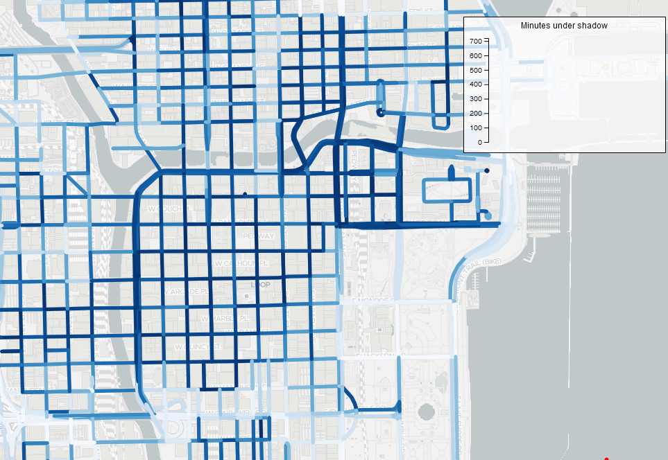

# CS594 - Big Data Visualization & Analytics (Fall 2021)

Instructor: Fabio Miranda

Course webpage: https://fmiranda.me/courses/cs594-fall-2021/

## Assignment 2: Angular and Flask
The goal of this assignment is to get you familiar with JavaScript / TypeScript, D3, Angular, and Flask. You will develop a web application to visualize the  distribution of accumulated shadows for each season of the year, making use of a front-end and back-end infrastructure. Similar to the previous assignment, the accumulated shadows were computed for three days of the year: June 21 (summer solstice), September 22 (autumnal equinox) and December 21 (winter solstice). Shadows can be greatly distorted when they are near the horizon, so all the shadows in the dataset are estimated from one and a half hours after sunrise to one and a half hours before sunset. This time, however, the shadow information was aggregated considering the street network, i.e., each street segment contains the accumulated shadow for the three days of the year.

You can download the datasets [here](https://raw.githubusercontent.com/uic-big-data/fall-2021-assignment-2/main/chicago-street-shadow.geojson), and find more information [here](https://fmiranda.me/publications/shadow-accrual-maps/) and [here](https://github.com/VIDA-NYU/shadow-accrual-maps/).

There are three tasks, and you are free to use the skeleton code provided. The skeleton code is an Angular project with two components and a service:

```
ng new vis
cd vis
ng generate component map
ng generate component chart
ng generate service data
```

The front-end code makes use of [D3.js](https://d3js.org/) and [OpenLayers](https://openlayers.org/):

```
npm install --save-dev d3 ol @types/d3 @types/ol
```

Even if using the skeleton code, you should run ```npm install``` inside the ```vis``` folder.

The back-end code makes use of [GeoPandas](https://geopandas.org/) and [Flask](https://flask.palletsprojects.com/). You can install it using [Conda](https://docs.conda.io/en/latest/) (or [Miniconda](https://docs.conda.io/en/latest/miniconda.html)):

```
conda install geopandas flask
```

If you want, you can create a new environment before installing GeoPandas and Flask:
```
conda create --name geopandas
conda activate geopandas
```

### Tasks

#### Task 1
Using Flask, create a new server (``server.py``) that loads the street network geojson file and serves the appropriate data to the front end. You have to implement the following methods:
* ``serve_network``: ``get`` method that should return the street network (loaded in the ``load`` function) .
* ``serve_distribution``: ``post`` method that receives a polygon (i.e., set of lat/lng coordinates) and returns the shadow distribution of all street segments **inside** the polygon. Read task 4 for a more detailed description of the shadow distribution.

Rather than use angular's server (i.e., ``ng serve``), ``server.py`` should serve all required files (see [ng build](https://angular.io/cli/build) for information on how to compile an app into an output directory). Note that the skeleton code **already** implements two methods to serve .html and .js files, and a ``load`` method to load the street network.


#### Task 2
Similar to the previous assignment, create an [OpenLayers](https://openlayers.org/) map inside the map component. The map should contain one [TileLayer](https://openlayers.org/en/latest/apidoc/module-ol_layer_Tile-TileLayer.html) (e.g., ``new OSM()``, but you are free to use [tiles accessed through URLs](https://openlayers.org/en/latest/examples/xyz.html)). Make sure to set the view so that it is centered in Chicago (i.e., ``center: transform([-87.6298, 41.8781], 'EPSG:4326', 'EPSG:3857')``). This time, you should create a vector layer that makes a request to the task 1 server for the street network geojson file.

Each segment of the street network should be painted according to the shadow value properties (e.g., ``chi-jun-21``). You can use ``d3-scale-chromatic`` to linearly map between shadow values and colors. After completing this task, you should see something similar to the image below:


<p align="center">
  
</p>

#### Task 3
In the map component, implement a selection functionality that allows the user to draw an arbitrary polygon **and** translate it if selected. In order to achieve this, make yourself familiar with the [Draw](https://openlayers.org/en/latest/apidoc/module-ol_interaction_Draw-Draw.html) and [Selection](https://openlayers.org/en/latest/apidoc/module-ol_interaction_Select-Select.html) classes.

After completing this task, you should see something similar to the image below:

<p align="center">
  
</p>

#### Task 4
In the chart component, create a chart that, given a selection, visualizes the **distribution** of shadow values for all seasons. You can use any metaphor that allows you to visualize distributions (histogram, violin plot, box plot, etc). Notice that, given a selection, you will have a set of street segments and, for each season, a set of shadow values; you then have a distribution of shadow values for each season. 

In the data service, implement the funcionality that requests the distribution from the server (``/serve_distribution``) using [HTTP](https://angular.io/guide/http). The map component should access the data service, and then update the chart component with the distribution data. You should ensure that your ``serve_distribution`` method returns an appropriate description of these distributions (mean, std. deviation, percentile, etc), in order for you to use this information when creating the charts.

After completing this task, you should see something similar to the image below:




### Submission
The delivery of the assignment will be done using GitHub Classes. You are free to use any external library for your assignment.

[git](https://en.wikipedia.org/wiki/Git) is a version control system, designed to help developers track different versions of your code, synchronize them across different machines, and collaborate with others. Follow the instructions [here](https://git-scm.com/book/en/v2/Getting-Started-Installing-Git) to install git on your computer. [GitHub](https://github.com/) is a website that supports git as a service. [This](https://guides.github.com/activities/hello-world/) is a nice tutorial on how to get started with git and GitHub.

We will provide a GitHub Classroom link for each assignment. Follow the link to create a repository. Use `git clone` to get a local copy of the newly created repository. After writing your code, you can push your modifications to the server using `git commit` followed by `git push`. For example, if your username is `uic-user`:

```
git clone git@github.com:uic-big-data/assignment-2-uic-user.git
git commit -am "submission"
git push
```

### Hints and tips

In task 1, Notice that the skeleton code uses [GeoPandas](https://geopandas.org/) to load the street network. You should use one of its funcionalities to filter the street segments that are inside the polygon.

You should request the geojson file from the Python server. This can be achieved by using the ``url`` parameter when creating the vector source:
```typescript
var vectorSource = new VectorSource({
  url: environment.filesurl+'/network',
  format: new GeoJSON()
});
```


### Grading
The code will be evaluated on Firefox. Your submission will be graded according to the quality of the results and interactions.

To get a C on the assignment, your application should display a map of Chicago with the street network. To get a B on the assignment, your application must enable the creation of selections. To get an A on the assignment, the application must update the chart so that, given a selection, it displays the distribution of shadow values for each seasons.
